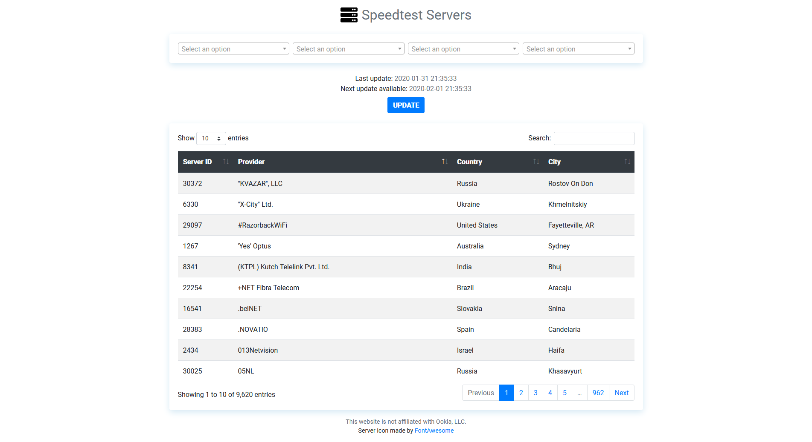

# Speedtest Servers

> A website where you can find all the speedtest.net servers.

## Requirements

- Python 3.8
- pipenv

## Installation

Clone or download zip

- Run ``pipenv install`` in directory to install requirements

## Development setup

- Run ``pipenv install --dev`` to install dev dependencies
- Run ``pipenv run python dev.py`` to start the wsgi development server on [http://127.0.0.1:5000](http://127.0.0.1:5000)

## License

Distributed under the MIT license. See ``LICENSE`` for more information.

## Contributing

1. Fork it
2. Commit your changes
3. Push to the branch
4. Create a new Pull Request
